<p align="center">
  
</p>

<h1 align="center">Hi, I'm <a href="https://jerome-prakash-l.github.io/elonmusk_jp/">Jerome Prakash L</a> 👋</h1>

<p align="center">
  <strong>Computer Science Engineering student building AI agents, automation tools, and computer vision projects.</strong>
</p>

<p align="center">
  <a href="https://jerome-prakash-l.github.io/elonmusk_jp/"></a>
  <a href="https://github.com/JEROME-PRAKASH-L"></a>
  <a href="https://github.com/JEROME-PRAKASH-L?tab=followers"></a>
  <a href="mailto:prakashjerome152@gmail.com"></a>
  
</p>

<p align="center">
  <code>AI Agents</code>&nbsp; • &nbsp;<code>Automation</code>&nbsp; • &nbsp;<code>Computer Vision</code>&nbsp; • &nbsp;<code>Full-Stack Development</code>
</p>

---

## 👨‍💻 About Me

```yaml
name: Jerome Prakash L
role: Computer Science Engineering Student
location: Chennai, India
focus:
  - AI agents and practical automation
  - Real-time computer vision
  - Browser productivity tools
currently_learning:
  - Agentic AI and RAG systems
  - Backend workflows
  - Data structures and algorithms
open_to:
  - Software Engineering internships
  - AI Engineering internships
  - Open-source collaboration
```

> I enjoy turning ambitious ideas into useful products—from AI coding workflows and document analysis to gesture-controlled interfaces and focus tools.

---

## 🧰 Languages & Tools

<p align="center">
  
</p>

<div align="center">

| Area | Technologies |
|:---|:---|
| **Languages** | Python · JavaScript · TypeScript · Java · HTML · CSS |
| **AI & Automation** | AI agents · Prompt engineering · RAG concepts · Workflow automation |
| **Developer Tools** | Git · GitHub · WSL2/Linux · CLI tooling · REST APIs · Telegram bots |
| **Computer Vision** | Hand tracking · Gesture detection · Human-computer interaction |
| **AI Copilots** | Claude · Codex · GitHub Copilot · ChatGPT |

</div>

---

## 🚀 Featured Projects

| Project | Built to demonstrate | Next milestone |
|:---|:---|:---|
| **[AI-Powered Document Analysis Extraction](https://github.com/JEROME-PRAKASH-L/AI-Powered-Document-Analysis-Extraction)** | TypeScript document-analysis workflow | Add sample files, screenshots, and a guided demo |
| **[OpenClaw](https://github.com/JEROME-PRAKASH-L/openclaw)** | Telegram-based AI coding workflow | Add architecture notes and a beginner-friendly quickstart |
| **[Make Me Productive — YouTube Focus Buddy](https://github.com/JEROME-PRAKASH-L/Make-Me-Productive---Youtube-Focus-Buddy)** | Browser productivity tooling | Add demo media, installation steps, and contribution tasks |
| **[AI Campus Copilot](https://github.com/JEROME-PRAKASH-L/Al-Campus-Copilot)** | Campus-focused AI assistant concepts | Stabilize the app structure and document its main use cases |

<details>
<summary><strong>What I'm building now</strong></summary>

- **AI Daily Inbox Recap Agent** — summarizes Gmail and Calendar activity into a useful daily brief.
- **OpenClaw** — a Telegram-based coding workflow that turns chat instructions into local project files.
- **Computer vision experiments** — hand tracking, gesture interaction, and real-time human-computer interaction.
- **Automation tools** — Python and API workflows that reduce repetitive manual work.

</details>

---

## 📊 GitHub Analytics

<p align="center">
  
  
</p>

<p align="center">
  
</p>

<p align="center">
  <picture>
    <source media="(prefers-color-scheme: dark)" srcset="https://raw.githubusercontent.com/JEROME-PRAKASH-L/JEROME-PRAKASH-L/output/github-snake-dark.svg" />
    <source media="(prefers-color-scheme: light)" srcset="https://raw.githubusercontent.com/JEROME-PRAKASH-L/JEROME-PRAKASH-L/output/github-snake.svg" />
    
  </picture>
</p>

<details>
<summary><strong>View the animated 3D contribution skyline</strong></summary>

<p align="center">
  
</p>

</details>

---

## 🎓 Education & Certifications

<details>
<summary><strong>B.E. Computer Science Engineering · DMI College of Engineering, Chennai</strong></summary>

**August 2024 – August 2028 (expected)**

- 5-Day AI Agents Intensive Course with Google (Kaggle)
- Agentic AI Day (Hack2skill)
- AWS Educate: Machine Learning Foundations
- Building RAG Apps Using MongoDB
- J.P. Morgan Software Engineering Job Simulation (Forage)
- Learn Git (Educative)
- Prompt Engineering with ChatGPT

</details>

---

## 🤝 Let's Connect

<p align="center">
  <a href="https://linkedin.com/in/jerome-prakash-975a15326"></a>
  <a href="mailto:prakashjerome152@gmail.com"></a>
  <a href="https://github.com/JEROME-PRAKASH-L"></a>
</p>

<p align="center">
  I'm open to internships, collaborations, and beginner-friendly open-source work in AI, automation, computer vision, Python, and full-stack development.
</p>

---

<p align="center">
  <strong>Always learning · Always building · Always improving</strong><br />
  <sub>Thanks for visiting—take a look around and let's build something useful.</sub>
</p>
