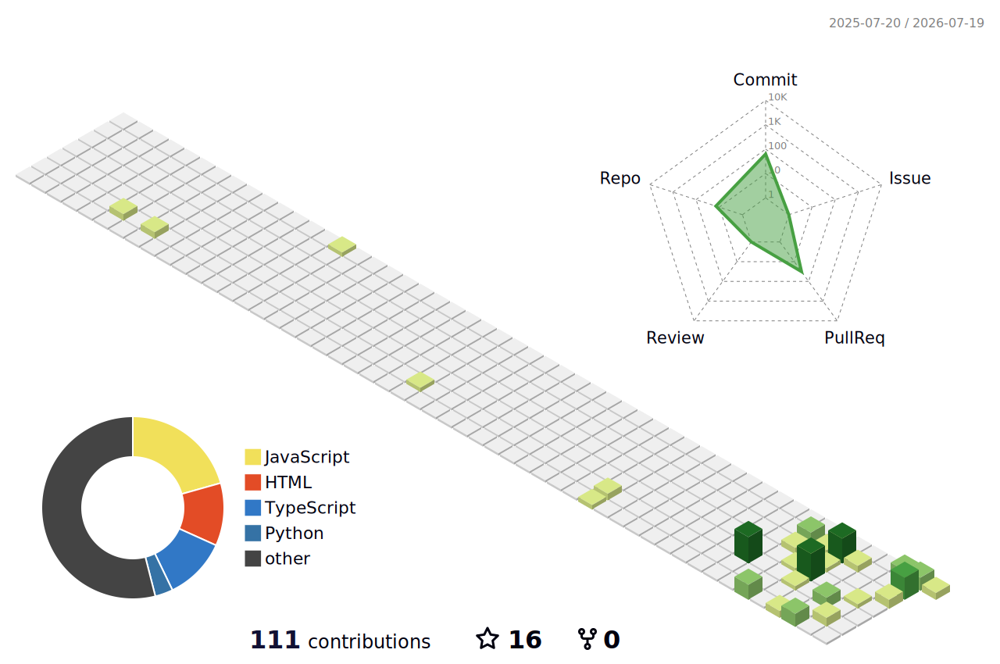

<div align="center">


</div>

<br/>

```console
jerome@github:~$ fastfetch --profile
```

```text
     ██╗███████╗██████╗  ██████╗ ███╗   ███╗███████╗
     ██║██╔════╝██╔══██╗██╔═══██╗████╗ ████║██╔════╝
     ██║█████╗  ██████╔╝██║   ██║██╔████╔██║█████╗
██   ██║██╔══╝  ██╔══██╗██║   ██║██║╚██╔╝██║██╔══╝
╚█████╔╝███████╗██║  ██║╚██████╔╝██║ ╚═╝ ██║███████╗
 ╚════╝ ╚══════╝╚═╝  ╚═╝ ╚═════╝ ╚═╝     ╚═╝╚══════╝

jerome-prakash-l @ github
──────────────────────────────────────────────────────────────
 Subject ............ Jerome Prakash L
 Role ............... CSE Undergrad · AI/Automation Builder
 Origin ............. Chennai, India
 Education .......... B.E. CSE · DMI College of Engineering
                      2024 → 2028 (expected)
 Status ............. Building · Learning · Shipping
 Seeking ............ SWE / AI Engineering internships

 Toolchain .......... VS Code, Git, WSL2/Linux, CLI, REST APIs

 Core Lang .......... Python, JavaScript, TypeScript
 Core Frontend ...... HTML, CSS, browser extensions
 Core AI ............ AI agents, RAG, prompt engineering
 Core Vision ........ Hand tracking, gesture interaction
 Core Automation .... Telegram bots, workflow pipelines
 Core Copilots ...... Claude, Codex, GitHub Copilot, ChatGPT

 ─ Contact ────────────────────────────────────────────────────
 Grid Mail .......... prakashjerome152@gmail.com
 Grid LinkedIn ...... linkedin.com/in/jerome-prakash-975a15326
 Grid GitHub ........ github.com/JEROME-PRAKASH-L

 ─ Live Stats ─────────────────────────────────────────────────
 » See live GitHub stats badges below in README
```

<p align="center">
  
</p>

---

```console
jerome@github:~$ cat /var/log/build.log
```

```text
[ ACTIVE ]  AI Daily Inbox Recap Agent .... Gmail + Calendar → daily brief
[ ACTIVE ]  OpenClaw ...................... Telegram-based AI coding agent
[ ACTIVE ]  Vision experiments ............ hand tracking · gesture control
[ ACTIVE ]  Automation tools .............. Python + API workflow pipelines
```

| Project | What it shows |
|---|---|
| [AI-Powered Document Analysis Extraction](https://github.com/JEROME-PRAKASH-L/AI-Powered-Document-Analysis-Extraction) | TypeScript document analysis workflow |
| [OpenClaw](https://github.com/JEROME-PRAKASH-L/openclaw) | Telegram-based AI coding workflow |
| [Make Me Productive — YouTube Focus Buddy](https://github.com/JEROME-PRAKASH-L/Make-Me-Productive---Youtube-Focus-Buddy) | Browser productivity tooling |
| [AI-Campus-Copilot](https://github.com/JEROME-PRAKASH-L/Al-Campus-Copilot) | Campus-focused AI assistant |

---

```console
jerome@github:~$ cat /etc/certs.conf
```

```text
[✓] 5-Day AI Agents Intensive Course with Google (Kaggle)
[✓] Agentic AI Day (Hack2skill)
[✓] AWS Educate: Machine Learning Foundations
[✓] Building RAG Apps Using MongoDB
[✓] J.P. Morgan Software Engineering Job Simulation (Forage)
[✓] Learn Git (Educative)
[✓] Prompt Engineering with ChatGPT
```

---

```console
jerome@github:~$ gh stats --live
```

<p align="center">
  
  
</p>

<p align="center">
  
</p>

<p align="center">
  <picture>
    <source media="(prefers-color-scheme: dark)" srcset="https://raw.githubusercontent.com/JEROME-PRAKASH-L/JEROME-PRAKASH-L/output/github-snake-dark.svg" />
    <source media="(prefers-color-scheme: light)" srcset="https://raw.githubusercontent.com/JEROME-PRAKASH-L/JEROME-PRAKASH-L/output/github-snake.svg" />
    
  </picture>
</p>

<details>
<summary><b>3D contribution view</b></summary>

<p align="center">
  
</p>

</details>

---

```console
jerome@github:~$ netstat --connections
```

```text
[ACTIVE CONNECTIONS]
  → Email ....... prakashjerome152@gmail.com
  → LinkedIn .... linkedin.com/in/jerome-prakash-975a15326
  → GitHub ...... github.com/JEROME-PRAKASH-L

[STATUS] All channels open for internships, collaborations,
         and open-source work in AI agents, automation,
         computer vision, and full-stack projects.
```

<p align="center">
  <a href="https://linkedin.com/in/jerome-prakash-975a15326" target="_blank"></a>
  <a href="mailto:prakashjerome152@gmail.com"></a>
  <a href="https://github.com/JEROME-PRAKASH-L" target="_blank"></a>
</p>

---

```console
jerome@github:~$ echo $MOTTO
Always learning. Always building. Always improving.
```
