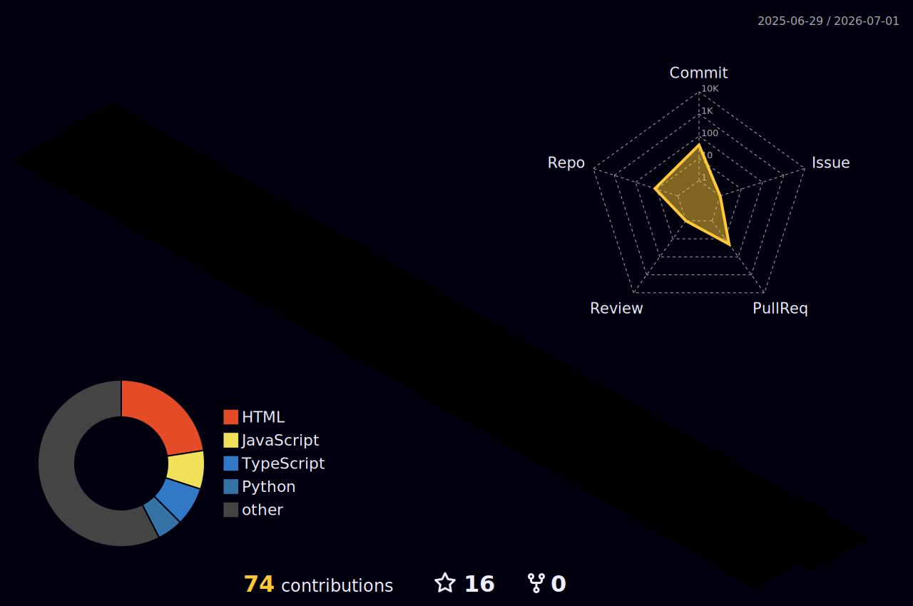

<!-- ===================== JEROME PRAKASH L — PROFILE README ===================== -->

<p align="center">
  
</p>

<p align="center">
  <a href="https://github.com/JEROME-PRAKASH-L">
    
  </a>
</p>

<p align="center">
  
  
  
</p>

---

### `jerome@mission-control:~$ whoami`

```
┌──────────────────────────────────────────────────────────────┐
│  Name      :  Jerome Prakash L                                │
│  Role      :  CSE Student | AI-Agent & Automation Builder     │
│  Location  :  Chennai, Tamil Nadu, India                      │
│  Building  :  Practical AI tools, workflow automations &      │
│               developer productivity systems.                 │
│  Approach  :  First principles · Ship fast · Iterate          │
│  Status    :  Seeking a Software / AI Engineering Internship  │
└──────────────────────────────────────────────────────────────┘
```

---

### 🚀 Mission Control

| Focus | Details |
|---|---|
| **Vision** | Build AI systems that save human time |
| **Approach** | First-principles thinking + fast prototyping |
| **Current Work** | AI Agents, Automation, Computer Vision |
| **Goal** | Turn ideas into real working products |
| **Status** | Open to internships and collaborations |

---

### 🧠 Operating Principles

```
01 ·  Reason from first principles — not by analogy.
02 ·  Ship fast, then iterate relentlessly.
03 ·  Automate the boring. Focus energy on the hard.
04 ·  Build things people actually use.
05 ·  Stay curious. Learn in public. Compound daily.
```

---

### 🛰️ Live Build Log

<details open>
<summary><b>🔨 What I'm building right now</b> — <i>(click to expand / collapse)</i></summary>
<br/>

- 🤖 **AI Daily Inbox Recap Agent** — summarizes your day from Gmail + Calendar
- 💬 **Telegram AI Coding Agent** (OpenClaw) — generate code from a chat message
- 👁️ **Computer Vision** hand-tracking & gesture projects
- ⚙️ **Automation tools** using Python and REST APIs
- 🌐 **Developer productivity** systems

</details>

---

### 🧰 Flight Manifest — Tech Arsenal

<details open>
<summary><b>💻 Languages &amp; Tools I fly with</b></summary>
<br/>

```
[ LANGUAGES ]       Python · JavaScript · HTML · CSS
[ AI & AUTOMATION ] AI agents & connectors · Prompt engineering · Workflow automation
                    Gmail automation · Google Calendar workflows · RAG concepts
[ AI COPILOTS ]     Claude · Codex · GitHub Copilot · ChatGPT
[ TOOLS ]           Git · GitHub · WSL2 / Linux · CLI tooling · REST APIs · Telegram bots
[ VISION ]          Hand & gesture detection · Real-time human-computer interaction
```

<p align="center">
  
</p>

</details>

---

### 🛸 AI Copilots in the Cockpit

> I don't just build AI — I **build with AI**. These are the copilots I pair with daily to ship faster.

<p align="center">
  
  
  
  
</p>

```
$ ai-stack --status
  ✓ Claude          ready   ·  reasoning · code · agents
  ✓ Codex           ready   ·  code generation
  ✓ GitHub Copilot  ready   ·  inline autocomplete
  ✓ ChatGPT         ready   ·  brainstorming · prototyping
[ STATUS ]  4 copilots online — shipping at orbital velocity 🚀
```

---

### 🤖 Mission Archive — Projects

<details open>
<summary><b>🤖 AI Daily Inbox Recap Automation</b> — <code>Python · Gmail API · Google Calendar · AI Agents</code></summary>
<br/>

- Aggregates the last 24 hours of Gmail activity and pulls in relevant calendar context to surface what matters each morning.
- Extracts and prioritizes action items, then delivers a clean summary email — cutting daily manual inbox triage.

</details>

<details>
<summary><b>💬 Telegram-Based AI Coding Agent (OpenClaw)</b> — <code>WSL2 · Telegram Bot · JavaScript · HTML/CSS</code></summary>
<br/>

- An AI coding-agent workflow on WSL2 with Telegram as the natural-language instruction interface.
- Receives coding requests over Telegram and generates project files directly on the local machine.

</details>

---

### 🎓 Credentials

<details>
<summary><b>🎓 Education &amp; Certifications</b></summary>
<br/>

```
🎓  B.E. Computer Science Engineering — DMI College of Engineering
    Aug 2024 – Aug 2028 (Expected) · Chennai, India
    Coursework: Data Structures · Algorithms · Web Development · UX Design · Digital Systems

✓ 5-Day AI Agents Intensive Course with Google            (Kaggle)
✓ Agentic AI Day                                          (Hack2skill)
✓ AWS Educate: Machine Learning Foundations               (Amazon Web Services)
✓ Building RAG Apps Using MongoDB                         (MongoDB)
✓ J.P. Morgan Software Engineering Job Simulation         (Forage)
✓ Learn Git                                               (Educative)
✓ Prompt Engineering with ChatGPT
```

</details>

---

### 🎯 2026 Launch Goals

```
[██████████░░░░░░░░░░]  Ship more AI agents & automations
[████████████░░░░░░░░]  Land a Software / AI Engineering internship
[██████░░░░░░░░░░░░░░]  Build & launch a Computer Vision product
[████░░░░░░░░░░░░░░░░]  Make first open-source contributions
```

- [x] 🤖 Build working AI-agent automations
- [x] 💬 Ship a Telegram coding agent
- [ ] 🚀 Land a Software / AI internship
- [ ] 👁️ Launch a Computer Vision product
- [ ] 🌍 Contribute to open source

---

### 🐍 Contribution Snake

<p align="center">
  <picture>
    <source media="(prefers-color-scheme: dark)" srcset="https://raw.githubusercontent.com/JEROME-PRAKASH-L/JEROME-PRAKASH-L/output/github-snake-dark.svg" />
    <source media="(prefers-color-scheme: light)" srcset="https://raw.githubusercontent.com/JEROME-PRAKASH-L/JEROME-PRAKASH-L/output/github-snake.svg" />
    
  </picture>
</p>

---

### 🌌 3D Contribution Galaxy

<p align="center">
  
</p>

---

### 🤝 Let's Connect

I'm open to **software engineering, AI engineering, and automation internships**.

I'm interested in: **AI Agents · Automation · Computer Vision · Python Development · Full-stack Projects**

<p align="left">
  <a href="https://linkedin.com/in/jerome-prakash-975a15326" target="_blank"></a>
  <a href="mailto:prakashjerome152@gmail.com"></a>
  <a href="https://github.com/JEROME-PRAKASH-L" target="_blank"></a>
</p>

```
📥  Email     :  prakashjerome152@gmail.com
🔗  LinkedIn  :  linkedin.com/in/jerome-prakash-975a15326
💻  GitHub    :  github.com/JEROME-PRAKASH-L
```

---

<p align="center"><i>"When something is important enough, you do it even if the odds are not in your favor."</i></p>
<p align="center"><b>⚡ Always Learning. Always Building. Always Launching. 🚀</b></p>


