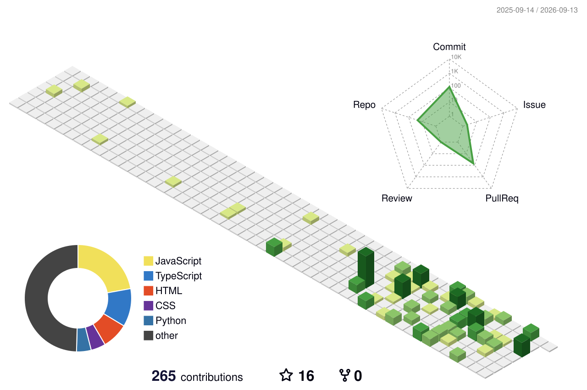

<p align="center">
  
</p>

<h1 align="center">JEROME PRAKASH L</h1>

<h3 align="center">THINK DIFFERENTLY&nbsp; // &nbsp;BUILD DELIBERATELY&nbsp; // &nbsp;SHIP WHAT MATTERS</h3>

<p align="center">
  <strong>CSE Student · AI Agent & Automation Builder · Full-Stack Developer · Computer Vision Explorer</strong>
</p>

<p align="center">
  <a href="https://jerome-prakash-l.github.io/elonmusk_jp/"></a>
  <a href="https://jerome-prakash-l.github.io/elonmusk_jp/Jerome_Prakash_L_Resume.pdf"></a>
  <a href="https://linkedin.com/in/jerome-prakash-975a15326"></a>
  <a href="mailto:prakashjerome152@gmail.com"></a>
  <a href="https://github.com/JEROME-PRAKASH-L?tab=followers"></a>
  
</p>

<p align="center">
  🌐 <strong>Portfolio:</strong> <a href="https://jerome-prakash-l.github.io/elonmusk_jp/">jerome-prakash-l.github.io/elonmusk_jp/</a>
</p>

<p align="center">
  <code>ARC REACTOR: 100%</code>&nbsp; • &nbsp;<code>J.A.R.V.I.S.: ONLINE</code>&nbsp; • &nbsp;<code>MARK: JPL-26</code>&nbsp; • &nbsp;<code>SKY TELEMETRY: LIVE</code>&nbsp; • &nbsp;<code>BASE: CHENNAI</code>
</p>

> **INVENTOR'S NOTE:** I do not wait for the future to feel inevitable. I study the problem, prototype the system, and make the idea useful.

<p align="center"></p>

## 01 // THE PERSON INSIDE THE ARMOR

```typescript
const jerome = {
  identity: "Jerome Prakash L",
  role: "Computer Science Engineering Student",
  base: "Chennai, India",
  focus: [
    "AI agents and practical automation",
    "Full-stack product engineering",
    "Real-time computer vision",
    "Data analytics and intelligent workflows"
  ],
  currentUpgrades: [
    "Agentic AI and RAG systems",
    "Next.js, Supabase, and backend workflows",
    "Data structures and algorithms",
    "Open-source engineering"
  ],
  longTermMission: "Build useful AI now and grow toward space-tech entrepreneurship",
  status: "Open to internships, collaboration, and ambitious engineering problems"
};
```

I build systems where **AI meets real human needs**—from document intelligence and campus assistants to local-service platforms, agricultural technology, productivity tools, data products, and gesture-controlled interfaces.

My goal is not to collect technologies. It is to combine the right ones into products that are clear, useful, secure, and ready to be tested by real people.

### Reactor status

| System | Live reading |
|:---|:---|
| **Armor Mark** | JPL-26 |
| **Arc Core** | 100% power |
| **J.A.R.V.I.S.** | Online |
| **Neural Link** | Online |
| **Sky Telemetry** | Live — starfield, glints, and comet orbits streaming |
| **Flight Dampers** | Silk-smooth easing online — hover, aurora, and holo-hexagons stabilized |
| **Suit Assembly** | Armor plates lock on boot — assembly protocol V11 |
| **Repair Drones** | Deployed — hull weld inspection active |
| **Arc Pulse** | Steady — reactor heartbeat traced on the top rail |
| **Schematic Mode** | X-ray blueprint sweep — MK-26 dimensions on record |
| **Nanite Swarm** | Standing by — hull breaches sealed automatically |
| **Aux Power** | Armed — reroute holds the grid through a brownout |
| **System Health** | Nominal |
| **Build Mode** | Active |
| **Primary Directive** | Build the future |
| **Mission Status** | Ready to collaborate |

<p align="center"></p>

## 02 // ENGINEERING PROTOCOLS

| Protocol | What it means in my lab |
|:---|:---|
| **Question the default** | A familiar solution is not automatically the best solution. |
| **Prototype the bold idea** | Turn imagination into something people can see, test, and improve. |
| **Engineer for usefulness** | Technology matters when it solves a real problem for a real person. |
| **Learn in public** | Every repository is evidence of progress, not a claim of perfection. |
| **Own the outcome** | Understand the system, document decisions, and improve what fails. |

<p align="center">
  
</p>

<p align="center"></p>

## 03 // MARK ARMOR STACK

<p align="center">
  
</p>

<p align="center">
  
</p>

| Armor module | Equipped systems |
|:---|:---|
| **Reactor Languages** | Python · JavaScript · TypeScript · Java · HTML · CSS |
| **Stark Web Systems** | React · Next.js · Tailwind CSS · Node.js · REST APIs |
| **Arc Intelligence** | AI agents · Prompt engineering · RAG concepts · Workflow automation |
| **Vision HUD** | Hand tracking · Gesture detection · OpenCV concepts · Human-computer interaction |
| **Data Lab** | Pandas · Matplotlib · Scikit-learn · Excel · Power BI · K-Means · Linear Regression |
| **Core Storage** | Supabase · MongoDB · Database fundamentals |
| **Embedded Bay** | Arduino UNO · Embedded C · Verilog HDL · Digital systems |
| **Flight Console** | Git · GitHub · Linux · Bash · VS Code · CLI tooling |
| **AI Copilots** | Codex · Claude · GitHub Copilot · ChatGPT |

<p align="center"></p>

## 04 // STARK MISSION DEPLOYMENTS

<p align="center">
  <a href="https://github.com/JEROME-PRAKASH-L/AI-Powered-Document-Analysis-Extraction"></a>
  <a href="https://github.com/JEROME-PRAKASH-L/skillbridge-local"></a>
</p>
<p align="center">
  <a href="https://github.com/JEROME-PRAKASH-L/uzhavar-360"></a>
  <a href="https://github.com/JEROME-PRAKASH-L/Al-Campus-Copilot"></a>
</p>
<p align="center">
  <a href="https://github.com/JEROME-PRAKASH-L/Make-Me-Productive---Youtube-Focus-Buddy"></a>
  <a href="https://github.com/JEROME-PRAKASH-L/Hand-Gesture-Mouse-Control-Project"></a>
</p>

<p align="center">
  <a href="https://skillbridge-local-chennai.netlify.app"></a>
  <a href="https://github.com/JEROME-PRAKASH-L/Volume-Control-project-"></a>
</p>

<details>
<summary><strong>MISSION DOSSIER // Capability breakdown</strong></summary>

| Mark / Mission | Core capability | Launch |
|:---|:---|:---:|
| **AI-Powered Document Analysis Extraction** | TypeScript workflow for intelligent document analysis and structured extraction | **[OPEN →](https://github.com/JEROME-PRAKASH-L/AI-Powered-Document-Analysis-Extraction)** |
| **SkillBridge Local** | Next.js and Supabase marketplace connecting local businesses with students | **[CODE →](https://github.com/JEROME-PRAKASH-L/skillbridge-local)** · **[LIVE →](https://skillbridge-local-chennai.netlify.app)** |
| **Uzhavar 360** | Digital platform designed to support farmers through accessible services and information | **[OPEN →](https://github.com/JEROME-PRAKASH-L/uzhavar-360)** |
| **AI Campus Copilot** | Campus-focused AI assistant concepts, student workflows, and academic support | **[OPEN →](https://github.com/JEROME-PRAKASH-L/Al-Campus-Copilot)** |
| **Make Me Productive** | Browser focus companion for more intentional YouTube use | **[OPEN →](https://github.com/JEROME-PRAKASH-L/Make-Me-Productive---Youtube-Focus-Buddy)** |
| **Gesture Control Lab** | Hand-gesture mouse control, volume control, drawing, and interaction experiments | **[MOUSE →](https://github.com/JEROME-PRAKASH-L/Hand-Gesture-Mouse-Control-Project)** · **[VOLUME →](https://github.com/JEROME-PRAKASH-L/Volume-Control-project-)** |

</details>

<!-- ============================ DEMO MEDIA ============================
     Ready-to-use markup. Record the clips listed in assets/demos/README.md,
     drop the files into assets/demos/, then delete these comment markers.

<p align="center">
  
  <br /><sub><strong>GESTURE CONTROL LAB</strong> — real-time hand tracking driving the cursor</sub>
</p>

<p align="center">
  
  <br /><sub><strong>SKILLBRIDGE LOCAL</strong> — posting and claiming a scoped student task</sub>
</p>

====================================================================== -->

<details>
<summary><strong>J.A.R.V.I.S. BUILD LOG // Active development</strong></summary>

- **Agentic AI systems** — exploring assistants, RAG workflows, and practical automation.
- **SkillBridge Local** — developing a marketplace for clearly scoped student micro-tech tasks.
- **Uzhavar 360** — building a farmer-focused digital service platform.
- **Computer vision experiments** — creating real-time hand tracking and gesture interactions.
- **Data products** — turning raw information into dashboards, predictions, and useful reports.

</details>

<p align="center"></p>

## 05 // FIELD TRAINING RECORDS

### THIRANEX // Data Analytics Internship

**17 June – 16 July 2026 · 4 weeks**

- Cleaned, transformed, and explored real-world datasets.
- Built sales and revenue dashboards, customer segments, and predictive models.
- Used Python, Pandas, Matplotlib, Scikit-learn, Excel, and Power BI.
- Applied K-Means clustering, Linear Regression, and reporting automation.

### ZARA TECH // VLSI & Embedded Control Basics

**22 June – 8 July 2026 · 15 days**

- Practised Verilog HDL modelling, testbenches, sequential circuits, and finite-state machines.
- Developed Arduino UNO projects using Embedded C.
- Built hands-on circuits from logic gates through a 4-bit ALU.
- Created LED-control and sensor-driven temperature-alert prototypes.

<p align="center"></p>

## 06 // LIVE ARC TELEMETRY

<p align="center">
  
  
</p>

<p align="center">
  
</p>

<p align="center">
  <picture>
    <source media="(prefers-color-scheme: dark)" srcset="https://raw.githubusercontent.com/JEROME-PRAKASH-L/JEROME-PRAKASH-L/output/github-snake-dark.svg" />
    <source media="(prefers-color-scheme: light)" srcset="https://raw.githubusercontent.com/JEROME-PRAKASH-L/JEROME-PRAKASH-L/output/github-snake.svg" />
    
  </picture>
</p>

<p align="center">
  
</p>

<details>
<summary><strong>HOLOGRAPHIC MAP // Animated 3D contributions</strong></summary>

<p align="center">
  
</p>

</details>

<p align="center"></p>

## 07 // ACADEMY & SYSTEM UPGRADES

**B.E. Computer Science Engineering**  
DMI College of Engineering, Chennai · August 2024 – August 2028 (expected)

<details>
<summary><strong>Loaded certifications and programmes</strong></summary>

- 5-Day AI Agents Intensive Course with Google (Kaggle)
- Agentic AI Day (Hack2skill)
- AWS Educate: Machine Learning Foundations
- Building RAG Apps Using MongoDB
- J.P. Morgan Software Engineering Job Simulation (Forage)
- Learn Git (Educative)
- Prompt Engineering with ChatGPT

</details>

<p align="center"></p>

## 08 // FLIGHT PLAN

| Phase | Mission objective | Status |
|:---|:---|:---:|
| **NOW** | Agentic AI and RAG systems · SkillBridge Local marketplace · DSA depth | `IN PROGRESS` |
| **NEXT** | Open-source contributions · AI/software internship · ship Uzhavar 360 | `QUEUED` |
| **HORIZON** | Build useful AI at scale and grow toward space-tech entrepreneurship | `LOCKED ON` |

> **J.A.R.V.I.S.:** "Course plotted, sir. All waypoints hold steady."

<p align="center"></p>

## 09 // OPEN COMM CHANNEL

<p align="center">
  <a href="https://jerome-prakash-l.github.io/elonmusk_jp/"></a>
  <a href="https://jerome-prakash-l.github.io/elonmusk_jp/Jerome_Prakash_L_Resume.pdf"></a>
  <a href="https://linkedin.com/in/jerome-prakash-975a15326"></a>
  <a href="mailto:prakashjerome152@gmail.com"></a>
  <a href="https://github.com/JEROME-PRAKASH-L"></a>
</p>

<p align="center">
  <strong>Open to AI/software internships, open-source collaboration, hackathons, and difficult ideas worth prototyping.</strong>
</p>

<p align="center"></p>

## 10 // BUILD NOTES

The banner above is not a template or a GIF. It is a single hand-authored SVG —
**1,110 lines and 271 declarative SMIL animations**, no JavaScript, no external assets,
with independent loops for the story sequence, suit-up, repair drone, blueprint X-ray,
nanite self-heal, and aux-power brownout.

<p align="center">
  <a href="./ARCHITECTURE.md"></a>
</p>

**[ARCHITECTURE.md](./ARCHITECTURE.md)** covers the animation timeline design, the easing
curve system, the `keySplines` mismatch that silently kills SMIL animations, and how each
beat is verified by driving the SMIL clock with `setCurrentTime` instead of guessing at
screenshots.

<p align="center">
  <sub>Every repository is a prototype. Every commit is a test. Every useful result earns the next upgrade.</sub><br />
  <sub>Original JPL developer interface inspired by Tony Stark's Arc Reactor energy and futuristic HUD design language.</sub>
</p>
